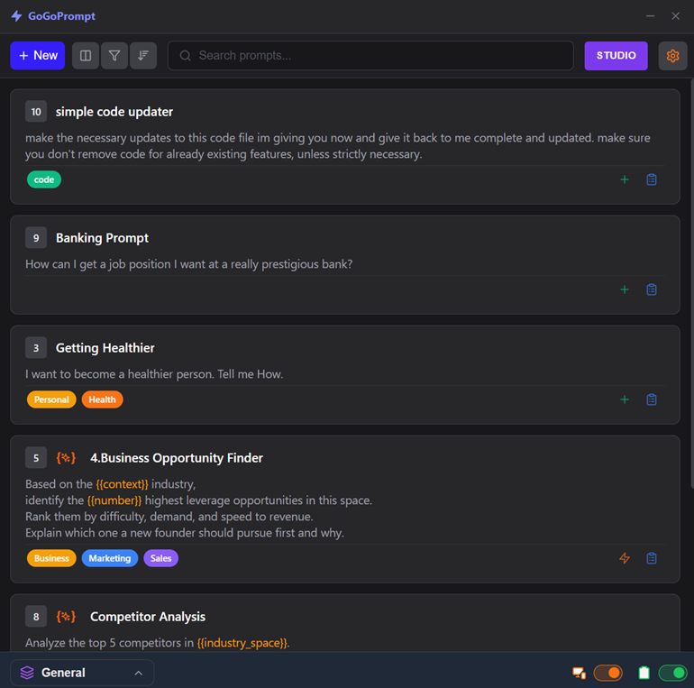
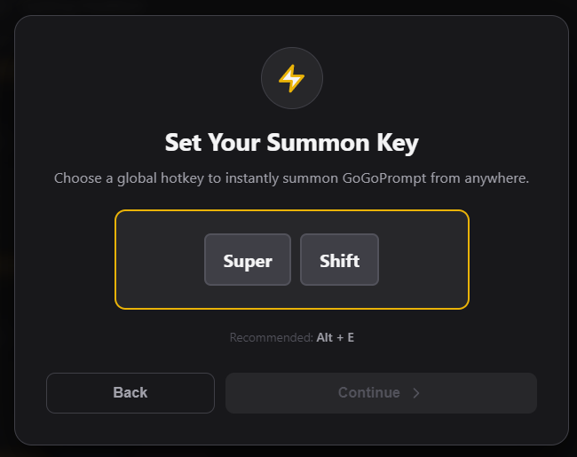
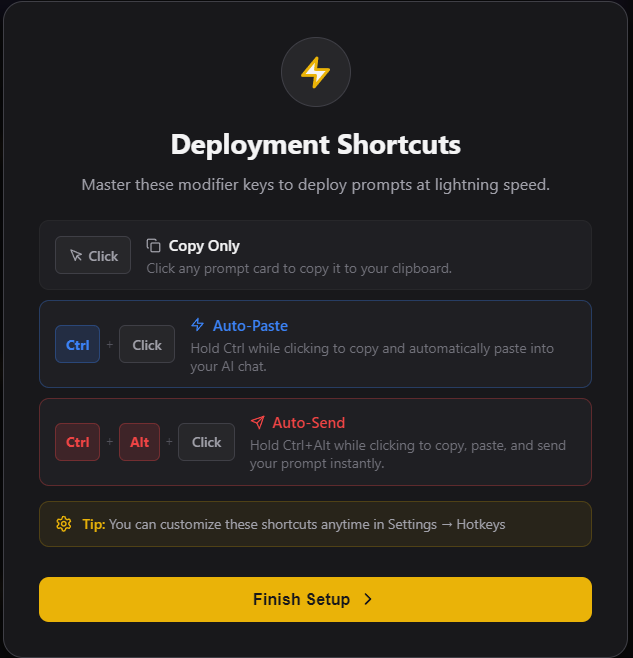
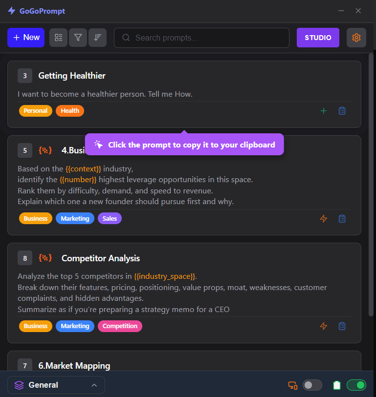
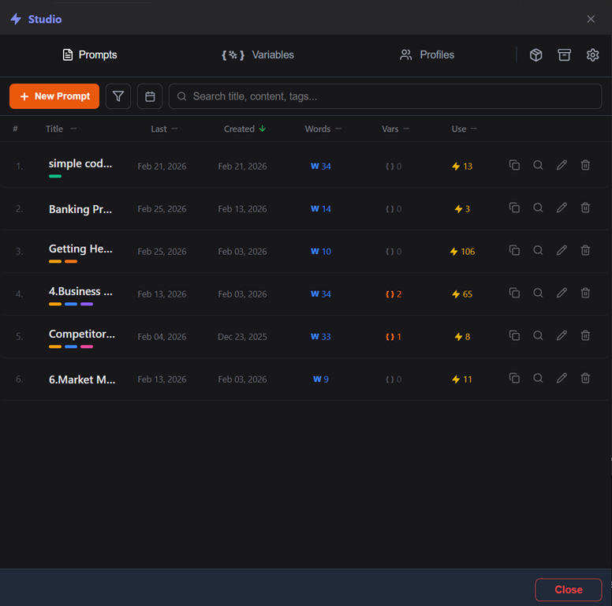
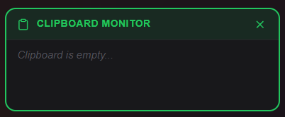

# GoGoPrompt

**A professional-grade prompt management utility built with Electron, React, and TypeScript.**

GoGoPrompt is a high-performance productivity tool designed to bridge the gap between your prompt library and your workflow. It allows you to summon your data instantly via a global hotkey and deploy content using a sophisticated 4-stage automation pipeline.

---



## 🚀 Main Features

### ⚡ Global Summoning

Access your library from anywhere in the OS with a single customizable hotkey. The app intelligently handles window focus, appearing instantly when needed and staying out of your way when not.



### 🛠️ The Deployment Pipeline

GoGoPrompt offers three distinct ways to get your data into target applications:

* **Copy Mode:** Standard high-speed copy to the system clipboard.
* **Auto-Paste:** Automatically switches focus to your target application and simulates a `Ctrl+V` command.
* **Auto-Send:** The most advanced mode; handles the focus switch, pastes the content, and simulates an `Enter` keypress to execute the prompt immediately.



### 🖥️ Specialized Interface Modes


**Deck Mode:** A minimized, streamlined interface for rapid selection during active work sessions.




**Studio Mode:** A full-featured environment for building, tagging, and organizing complex prompts.




**Clipboard Monitor:** An integrated utility that tracks and categorizes your local clipboard history for reuse.



---

## Tech Stack

* **Frontend:** React 18, TypeScript, Zustand (State Management)
* **Backend:** Electron (Node.js)
* **Automation:** OS-level keyboard simulation (PowerShell, AppleScript, xdotool)
* **Build Tool:** Vite & Electron-Builder


## 🛠️ Setting Up the App

Before you start, you need to install **Node.js** (this is the engine that allows the app to run). You can download it at [nodejs.org](https://nodejs.org/).

1. **Download the Code:** Click the green **Code** button on GitHub and select  **Download ZIP** . Unzip this folder anywhere on your computer.
2. **Open the Terminal:** * Right-click the unzipped folder.

   * Select **Open in Terminal** (or "Open PowerShell window here").
3. **Install the App Components:** Type the following command and press Enter:
   **PowerShell**

   ```
   npm install
   ```

   *Wait for the progress bar to finish. This downloads the "parts" the app needs to function.*
4. **Start the App:** Type the following command and press Enter:
   **PowerShell**

   ```
   npm start
   ```

   *The app will now open on your screen.*


## ⚡ Part 2: How to Use GoGoPrompt

### 1. Summoning the App (The Hotkey)

You don't need to click an icon to find your prompts. While you are working in any other program (like Chrome, Word, or Discord), simply press your **Global Hotkey** (default is usually `Alt + Space` or `Ctrl + Shift + P`).

GoGoPrompt will instantly appear on top of your current work.

### 2. Choosing Your "Deployment" Mode

When you find the prompt you want to use, you have three ways to "deploy" it into your target program:

| **Mode**       | **What it does**                                                | **Best for...**                           |
| -------------------- | --------------------------------------------------------------------- | ----------------------------------------------- |
| **Copy**       | Saves the text to your clipboard.                                     | When you want to paste it manually later.       |
| **Auto-Paste** | Instantly switches back to your work and pastes the text for you.     | Standard use in any text box.                   |
| **Auto-Send**  | Switches back, pastes the text, and**hits Enter**automatically. | Speed-running AI chats (ChatGPT, Claude, etc.). |


✨ First-Run Experience (Onboarding)

When you launch GoGoPrompt for the first time on a new computer, the app will automatically initialize in **Onboarding Mode**.

Instead of seeing the main dashboard, you will be greeted by an interactive walkthrough designed to:

* **Configure your Global Hotkey:** Set the key combination that summons the app.
* **Learn Deployment Modes:** Get a quick tutorial on how to use Copy, Auto-Paste, and Auto-Send.


❗Important

* **Keep the Terminal Open:** To use the app, the terminal window you used to start it must stay open in the background.
* **Target Application:** Before you summon GoGoPrompt to "Auto-Paste" or "Auto-Send," make sure your flashing text cursor is already clicking inside the box where you want the text to go.


## 📜 License

This project is licensed under a **Custom Non-Commercial Community & Evaluation License**. This legal framework is designed to allow for professional assessment and educational study while protecting the original work from unauthorized replication.

### 💼 Professional & Business Evaluation

* **Recruitment:** Hiring managers and recruiters are permitted to execute and review the code for technical skill assessment.
* **Business Collaboration:** Potential partners or clients may evaluate the software for professional collaboration or freelance opportunities with the Developer.

### 🎓 Educational & Personal Use

* **Learning:** Students and educators are permitted to use the codebase for academic study, learning, and experimentation.
* **Hobbyist Projects:** Use in personal, non-commercial projects that do not generate revenue is permitted.

### 🚫 Key Restrictions

* **No Replication:** Forking, mirroring, or replicating the repository for public distribution is strictly prohibited. The creation of derivative clones is forbidden.
* **Non-Commercial Only:** Use for any revenue-generating activities or within a commercial business environment is forbidden without prior written consent.
* **Attribution:** The original copyright notice and this permission notice must be included in all copies or substantial portions of the software.

For the full legal terms and conditions, refer to the `LICENSE` file located in the root directory of this repository.
